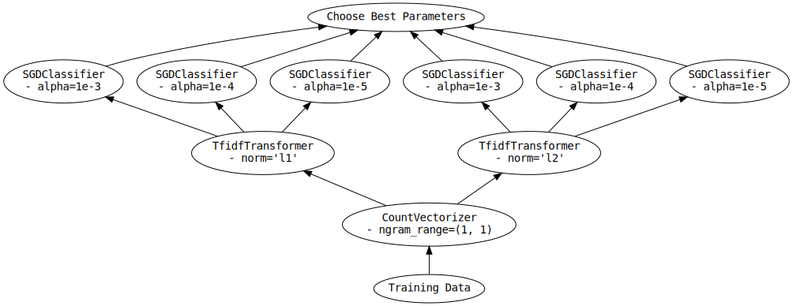
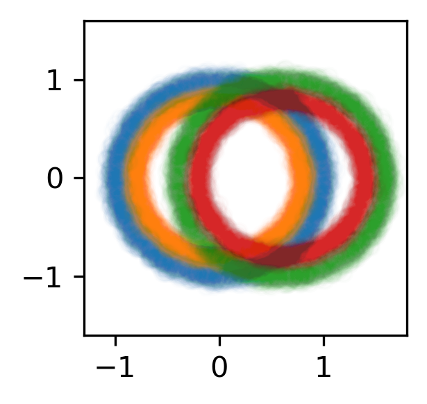
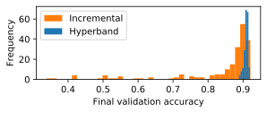
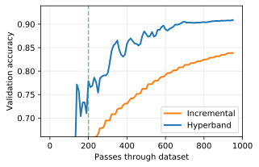
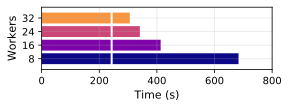

.. _hyper-parameter-search:

Hyper Parameter Search
======================

*Tools to perform hyperparameter optimizaiton of Scikit-Learn API-compatible
models using Dask, and to scale hyperparameter optimization to* **larger
data and/or larger searches.**

Hyperparameter searches are a required process in machine learning. Briefly,
machine learning models require certain "hyperparameters", model parameters
that can be learned from the data. Finding these good values for these
parameters is a "hyperparameter search" or an "hyperparameter optimization."
For more detail, see "`Tuning the hyper-parameters of an estimator
<https://scikit-learn.org/stable/modules/grid_search.html>`_."

These searches can take an ample time (days or weeks), especially when good
performance is desired and/or with massive datasets, which is common when
preparing for production or a paper publication. The following section
clarifies the issues that can occur:

* ":ref:`hyperparameter.scaling`" mentions problems that often occur in
  hyperparameter optimization searches.

Tools that address these problems are expanded upon in these sections:

1. ":ref:`hyperparameter.drop-in`" details classes that mirror the Scikit-learn
   estimators but work nicely with Dask objects and can offer better
   performance.
2. ":ref:`hyperparameter.incremental`" details classes that work well with
   large datasets.
3. ":ref:`hyperparameter.adaptive`" details classes that avoid extra
   computation and find high-performing hyperparameters more quickly.

.. _hyperparameter.scaling:

Scaling hyperparameter searches
-------------------------------

Dask-ML provides classes to avoid the two most common issues in hyperparameter
optimization, when the hyperparameter search is...

1. "**memory constrained"**. This happens when the dataset size is too large to
   fit in memory.  This typically happens when a model needs to be tuned for a
   larger-than-memory dataset after local development.
2. "**compute constrained**". This happen when the computation takes too long
   even with data that can fit in memory.  This typically happens when many
   hyperparameters need to be tuned or the model requires a specialized
   hardware (e.g., GPUs).

"Memory constrained" searches happen when the data doesn't fit in the memory of
a single machine:

.. code-block:: python

   >>> import pandas as pd
   >>> import dask.dataframe as dd
   >>>
   >>> ## not memory constrained
   >>> df = pd.read_csv("data/0.parquet")
   >>> df.shape
   (30000, 200)  # => 23MB
   >>>
   >>> ## memory constrained
   >>> # Read 1000 of the above dataframes (=> 22GB of data)
   >>> ddf = dd.read_parquet("data/*.parquet")

"Compute constrained" is when the hyperparameter search takes too long even if
the data fits in memory. There might a lot of hyperparameters to search, or the
model may require specialized hardware like GPUs:

.. code-block:: python

   >>> import pandas as pd
   >>> from scipy.stats import uniform, loguniform
   >>> from sklearn.linear_model import SGDClasifier
   >>>
   >>> df = pd.read_parquet("data/0.parquet")  # data to train on; 23MB as above
   >>>
   >>> model = SGDClasifier()
   >>>
   >>> # not compute constrained
   >>> params = {"l1_ratio": uniform(0, 1)}
   >>>
   >>> # compute constrained
   >>> params = {
   ...     "l1_ratio": uniform(0, 1),
   ...     "alpha": loguniform(1e-5, 1e-1),
   ...     "penalty": ["l2", "l1", "elasticnet"],
   ...     "learning_rate": ["invscaling", "adaptive"],
   ...     "power_t": uniform(0, 1),
   ...     "average": [True, False],
   ... }
   >>>

These issues are independent and both can happen the same time. Dask-ML has
tools to address all 4 combinations. Let's look at each case.

Neither compute nor memory constrained
^^^^^^^^^^^^^^^^^^^^^^^^^^^^^^^^^^^^^^

This case happens when there aren't many hyperparameters to tune and the data
fits in memory. This is common when the search doesn't take too long to run.

Scikit-learn can handle this case:

.. autosummary::
   sklearn.model_selection.GridSearchCV
   sklearn.model_selection.RandomizedSearchCV

Dask-ML also has some drop in replacements for the Scikit-learn versions that
works well with `Dask collections`_ (like Dask Arrays and Dask DataFrames):

.. _Dask collections: https://docs.dask.org/en/latest/user-interfaces.html#high-level-collections

.. autosummary::
   dask_ml.model_selection.GridSearchCV
   dask_ml.model_selection.RandomizedSearchCV

By default, these estimators will efficiently pass the entire dataset to
``fit`` if a Dask Array/DataFrame is passed.  More detail is in
":ref:`works-with-dask-collections`".

These estimators above work especially well with models that have expensive
preprocessing, which is common in natural language processing (NLP). More
detail is in ":ref:`hyperparameter.cpu-nmem`" and ":ref:`avoid-repeated-work`".

.. _hyperparameter.mem-ncpu:

Memory constrained, but not compute constrained
^^^^^^^^^^^^^^^^^^^^^^^^^^^^^^^^^^^^^^^^^^^^^^^

This case happens when the data doesn't fit in memory but there aren't many
hyperparameters to search over. The data doesn't fit in memory, so it makes
sense to call ``partial_fit`` on each chunk of a Dask Array/Dataframe. This
estimators does that:

.. autosummary::
   dask_ml.model_selection.IncrementalSearchCV

More detail on :class:`~dask_ml.model_selection.IncrementalSearchCV` is in
":ref:`hyperparameter.incremental`".

Dask's implementation of :class:`~dask_ml.model_selection.GridSearchCV` and
:class:`~dask_ml.model_selection.RandomizedSearchCV` can to also call
``partial_fit`` on each chunk of a Dask array, as long as the model passed is
wrapped with :class:`~dask_ml.wrappers.Incremental`.

.. _hyperparameter.cpu-nmem:

Compute constrained, but not memory constrained
^^^^^^^^^^^^^^^^^^^^^^^^^^^^^^^^^^^^^^^^^^^^^^^

This case happens when the data fits on in the memory of one machine but when
there are a lot of hyperparameters to search, or the models require specialized
hardware like GPUs. The best class for this case is
:class:`~dask_ml.model_selection.HyperbandSearchCV`:

.. autosummary::
   dask_ml.model_selection.HyperbandSearchCV

Briefly, this estimator is easy to use, has strong mathematical motivation and
performs remarkably well. For more detail, see
":ref:`hyperparameter.hyperband-params`" and
":ref:`hyperparameter.hyperband-perf`".

Two other adaptive hyperparameter optimization algorithms are implemented in these
classes:

.. autosummary::
   dask_ml.model_selection.SuccessiveHalvingSearchCV
   dask_ml.model_selection.InverseDecaySearchCV

The input parameters for these classes are a more difficult to configure.

All of these searches can reduce time to solution by (cleverly) deciding which
parameters to evaluate. That is, these searches *adapt* to history to decide
which parameters to continue evaluating.  All of these estimators support
ignoring models models with decreasing score via the ``patience`` and ``tol``
parameters.

Another way to limit computation is to avoid repeated work during during the
searches. This is especially useful with expensive preprocessing, which is
common in natural language processing (NLP).

.. autosummary::

   dask_ml.model_selection.RandomizedSearchCV
   dask_ml.model_selection.GridSearchCV

Avoiding repeated work with this class relies on the model being an instance of
Scikit-learn's :class:`~sklearn.pipeline.Pipeline`.  See
":ref:`avoid-repeated-work`" for more detail.

Compute and memory constrained
^^^^^^^^^^^^^^^^^^^^^^^^^^^^^^

This case happens when the dataset is larger than memory and there are many
parameters to search. In this case, it's useful to have strong support for Dask
Arrays/DataFrames `and` to decide which models to continue training.

.. autosummary::
   dask_ml.model_selection.HyperbandSearchCV
   dask_ml.model_selection.SuccessiveHalvingSearchCV
   dask_ml.model_selection.InverseDecaySearchCV

These classes work well with data that does not fit in memory. They also reduce
the computation required as described in ":ref:`hyperparameter.cpu-nmem`."

----------

Now, let's look at these classes in-depth.

1. ":ref:`hyperparameter.drop-in`" details
   :class:`~dask_ml.model_selection.RandomizedSearchCV` and
   :class:`~dask_ml.model_selection.GridSearchCV`.
2. ":ref:`hyperparameter.incremental`" details
   :class:`~dask_ml.model_selection.IncrementalSearchCV` and all it's
   subclasses (one of which is
   :class:`~dask_ml.model_selection.HyperbandSearchCV`).
3. ":ref:`hyperparameter.adaptive`" details usage and performance of
   :class:`~dask_ml.model_selection.HyperbandSearchCV`.

.. _hyperparameter.drop-in:

Drop-In Replacements for Scikit-Learn
-------------------------------------

Dask-ML implements drop-in replacements for
:class:`~sklearn.model_selection.GridSearchCV` and
:class:`~sklearn.model_selection.RandomizedSearchCV`.

.. autosummary::
   dask_ml.model_selection.GridSearchCV
   dask_ml.model_selection.RandomizedSearchCV

The varians in Dask-ML implement many (but not all) of the same parameters,
and should be a drop-in replacement for the subset that they do implement.
In that case, why use Dask-ML's versions?

- :ref:`Flexible Backends <flexible-backends>`: Hyperparameter
  optimization can be done in parallel using threads, processes, or distributed
  across a cluster.

- :ref:`Works well with Dask collections <works-with-dask-collections>`. Dask
  arrays, dataframes, and delayed can be passed to ``fit``.

- :ref:`Avoid repeated work <avoid-repeated-work>`. Candidate models with
  identical parameters and inputs will only be fit once. For
  composite-models such as ``Pipeline`` this can be significantly more
  efficient as it can avoid expensive repeated computations.

Both Scikit-learn's and Dask-ML's model selection meta-estimators can be used
with Dask's :ref:`joblib backend <joblib>`.

.. _flexible-backends:

Flexible Backends
^^^^^^^^^^^^^^^^^

Dask-ML can use any of the dask schedulers. By default the threaded
scheduler is used, but this can easily be swapped out for the multiprocessing
or distributed scheduler:

.. code-block:: python

    # Distribute grid-search across a cluster
    from dask.distributed import Client
    scheduler_address = '127.0.0.1:8786'
    client = Client(scheduler_address)

    search.fit(digits.data, digits.target)

.. _works-with-dask-collections:

Works Well With Dask Collections
^^^^^^^^^^^^^^^^^^^^^^^^^^^^^^^^

Dask collections such as ``dask.array``, ``dask.dataframe`` and
``dask.delayed`` can be passed to ``fit``. This means you can use dask to do
your data loading and preprocessing as well, allowing for a clean workflow.
This also allows you to work with remote data on a cluster without ever having
to pull it locally to your computer:

.. code-block:: python

    import dask.dataframe as dd

    # Load data from s3
    df = dd.read_csv('s3://bucket-name/my-data-*.csv')

    # Do some preprocessing steps
    df['x2'] = df.x - df.x.mean()
    # ...

    # Pass to fit without ever leaving the cluster
    search.fit(df[['x', 'x2']], df['y'])

This example will compute each CV split and store it on a single machine so
``fit`` can be called.

.. _avoid-repeated-work:

Avoid Repeated Work
^^^^^^^^^^^^^^^^^^^

When searching over composite models like ``sklearn.pipeline.Pipeline`` or
``sklearn.pipeline.FeatureUnion``, Dask-ML will avoid fitting the same
model + parameter + data combination more than once. For pipelines with
expensive early steps this can be faster, as repeated work is avoided.

For example, given the following 3-stage pipeline and grid (modified from `this
Scikit-learn example
<http://scikit-learn.org/stable/auto_examples/model_selection/grid_search_text_feature_extraction.html>`__).

.. code-block:: python

    from sklearn.feature_extraction.text import CountVectorizer, TfidfTransformer
    from sklearn.linear_model import SGDClassifier
    from sklearn.pipeline import Pipeline

    pipeline = Pipeline([('vect', CountVectorizer()),
                         ('tfidf', TfidfTransformer()),
                         ('clf', SGDClassifier())])

    grid = {'vect__ngram_range': [(1, 1)],
            'tfidf__norm': ['l1', 'l2'],
            'clf__alpha': [1e-3, 1e-4, 1e-5]}

the Scikit-Learn grid-search implementation looks something like (simplified):

.. code-block:: python

	scores = []
	for ngram_range in parameters['vect__ngram_range']:
		for norm in parameters['tfidf__norm']:
			for alpha in parameters['clf__alpha']:
				vect = CountVectorizer(ngram_range=ngram_range)
				X2 = vect.fit_transform(X, y)
				tfidf = TfidfTransformer(norm=norm)
				X3 = tfidf.fit_transform(X2, y)
				clf = SGDClassifier(alpha=alpha)
				clf.fit(X3, y)
				scores.append(clf.score(X3, y))
	best = choose_best_parameters(scores, parameters)

As a directed acyclic graph, this might look like:

.. figure:: images/unmerged_grid_search_graph.svg
   :alt: "Scikit-learn grid-search directed acyclic graph"
   :align: center

In contrast, the dask version looks more like:

.. code-block:: python

	scores = []
	for ngram_range in parameters['vect__ngram_range']:
		vect = CountVectorizer(ngram_range=ngram_range)
		X2 = vect.fit_transform(X, y)
		for norm in parameters['tfidf__norm']:
			tfidf = TfidfTransformer(norm=norm)
			X3 = tfidf.fit_transform(X2, y)
			for alpha in parameters['clf__alpha']:
				clf = SGDClassifier(alpha=alpha)
				clf.fit(X3, y)
				scores.append(clf.score(X3, y))
	best = choose_best_parameters(scores, parameters)

With a corresponding directed acyclic graph:

Looking closely, you can see that the Scikit-Learn version ends up fitting
earlier steps in the pipeline multiple times with the same parameters and data.
Due to the increased flexibility of Dask over Joblib, we're able to merge these
tasks in the graph and only perform the fit step once for any
parameter/data/model combination. For pipelines that have relatively
expensive early steps, this can be a big win when performing a grid search.

.. _hyperparameter.incremental:

Incremental Hyperparameter Optimization
---------------------------------------

.. autosummary::
   dask_ml.model_selection.IncrementalSearchCV
   dask_ml.model_selection.HyperbandSearchCV
   dask_ml.model_selection.SuccessiveHalvingSearchCV
   dask_ml.model_selection.InverseDecaySearchCV

These estimators all handle Dask arrays/dataframe identically. The example will
use :class:`~dask_ml.model_selection.HyperbandSearchCV`, but it can easily be
generalized to any of the above estimators.

.. note::

   These estimators require that the model implement ``partial_fit``.

By default, these class will call ``partial_fit`` on each chunk of the data.
These classes can stop training any models if their score stops increasing
(via ``patience`` and ``tol``). They even get one step fancier, and can choose
which models to call ``partial_fit`` on.

First, let's look at basic usage. ":ref:`hyperparameter.adaptive`" details
estimators that reduce the amount of computation required.

Basic use
^^^^^^^^^

This section uses :class:`~dask_ml.model_selection.HyperbandSearchCV`, but it can
also be applied to to :class:`~dask_ml.model_selection.IncrementalSearchCV` too.

.. ipython:: python

    from dask.distributed import Client
    from dask_ml.datasets import make_classification
    from dask_ml.model_selection import train_test_split
    client = Client()
    X, y = make_classification(chunks=20, random_state=0)
    X_train, X_test, y_train, y_test = train_test_split(X, y)

Our underlying model is an :class:`sklearn.linear_model.SGDClasifier`. We
specify a few parameters common to each clone of the model:

.. ipython:: python

    from sklearn.linear_model import SGDClassifier
    clf = SGDClassifier(tol=1e-3, penalty='elasticnet', random_state=0)

We also define the distribution of parameters from which we will sample:

.. ipython:: python

    from scipy.stats import uniform, loguniform
    params = {'alpha': loguniform(1e-2, 1e0),  # or np.logspace
              'l1_ratio': uniform(0, 1)}  # or np.linspace

Finally we create many random models in this parameter space and
train-and-score them until we find the best one.

.. ipython:: python

    from dask_ml.model_selection import HyperbandSearchCV

    search = HyperbandSearchCV(clf, params, max_iter=81, random_state=0)
    search.fit(X_train, y_train, classes=[0, 1]);
    search.best_params_
    search.best_score_
    search.score(X_test, y_test)

Note that when you do post-fit tasks like ``search.score``, the underlying
model's score method is used. If that is unable to handle a
larger-than-memory Dask Array, you'll exhaust your machines memory. If you plan
to use post-estimation features like scoring or prediction, we recommend using
:class:`dask_ml.wrappers.ParallelPostFit`.

.. ipython:: python

   from dask_ml.wrappers import ParallelPostFit
   params = {'estimator__alpha': loguniform(1e-2, 1e0),
             'estimator__l1_ratio': uniform(0, 1)}
   est = ParallelPostFit(SGDClassifier(tol=1e-3, random_state=0))
   search = HyperbandSearchCV(est, params, max_iter=9, random_state=0)
   search.fit(X_train, y_train, classes=[0, 1]);
   search.score(X_test, y_test)

Note that the parameter names include the ``estimator__`` prefix, as we're
tuning the hyperparameters of the :class:`sklearn.linear_model.SGDClasifier`
that's underlying the :class:`dask_ml.wrappers.ParallelPostFit`.

.. _hyperparameter.adaptive:

Adaptive Hyperparameter Optimization
------------------------------------

Dask-ML has these estimators that `adapt` to historical data to determine which
models to continue training. This means high scoring models can be found with
fewer cumulative calls to ``partial_fit``.

.. autosummary::
   dask_ml.model_selection.HyperbandSearchCV
   dask_ml.model_selection.SuccessiveHalvingSearchCV

:class:`~dask_ml.model_selection.IncrementalSearchCV` also fits in this class
when ``decay_rate=1``. All of these estimators require an implementation of
``partial_fit``, and they all work with larger-than-memory datasets as
mentioned in ":ref:`hyperparameter.incremental`".

:class:`~dask_ml.model_selection.HyperbandSearchCV` has several niceties
mentioned in the following sections:

* :ref:`hyperparameter.hyperband-params`: a good rule-of-thumb to determine
  :class:`~dask_ml.model_selection.HyperbandSearchCV`'s input parameters.
* :ref:`hyperparameter.hyperband-perf`: how quickly
  :class:`~dask_ml.model_selection.HyperbandSearchCV` will find high performing
  models.

Let's see how well Hyperband does when the inputs are chosen with the provided
rule-of-thumb.

.. _hyperparameter.hyperband-params:

Hyperband parameters: rule-of-thumb
^^^^^^^^^^^^^^^^^^^^^^^^^^^^^^^^^^^

:class:`~dask_ml.model_selection.HyperbandSearchCV` has two inputs:

1. ``max_iter``, which determines how many times to call ``partial_fit``
2. the chunk size of the Dask array, which determines how many data each
   ``partial_fit`` call receives.

These fall out pretty naturally once it's known how long to train the best
model and very approximately how many parameters to sample:

.. ipython:: python

   n_examples = 20 * len(X_train)  # 20 passes through dataset for best model
   n_params = 94  # sample approximately 100 parameters; more than 94 will be sampled

With this, it's easy use a rule-of-thumb to compute the inputs to Hyperband:

.. ipython:: python

   max_iter = n_params
   chunk_size = n_examples // n_params  # implicit

Now that we've determined the inputs, let's create our search object and
rechunk the Dask array:

.. ipython:: python

   clf = SGDClassifier(tol=1e-3, penalty='elasticnet', random_state=0)
   params = {'alpha': loguniform(1e-2, 1e0),  # or np.logspace
             'l1_ratio': uniform(0, 1)}  # or np.linspace
   search = HyperbandSearchCV(clf, params, max_iter=max_iter, aggressiveness=4, random_state=0)
   X_train = X_train.rechunk((chunk_size, -1))
   y_train = y_train.rechunk(chunk_size)

We used ``aggressiveness=4`` because this is an initial search. I don't know
much about the data, model or hyperparameters. If I had at least some sense of
what hyperparameters to use, I would specify ``aggressiveness=3``, the default.

The inputs to this rule-of-thumb are exactly what the user cares about:

* A measure of how complex the search space is (via ``n_params``)
* How long to train the best model (via ``n_examples``)
* How confident they are in the hyperparameters (via ``aggressiveness``).

Notably, there's no tradeoff between ``n_examples`` and ``n_params`` like with
:class:`~dask_ml.model_selection.RandomizedSearchCV` because ``n_examples`` is
only for *some* models, not for *all* models. There's more details on this
rule-of-thumb in the "Notes" section of
:class:`~dask_ml.model_selection.HyperbandSearchCV`

However, this does not explicitly mention the amount of computation performed
-- it's only an approximation. The amount of computation can be viewed like so:

.. ipython:: python

   search.metadata["partial_fit_calls"]  # best model will see `max_iter` chunks
   search.metadata["n_models"]  # actual number of parameters to sample

This samples many more hyperparameters than ``RandomizedSearchCV``, which would
only sample about 12 hyperparameters (or initialize 12 models) for the same
amount of computation.  Let's fit
:class:`~dask_ml.model_selection.HyperbandSearchCV` with these different
chunks:

.. ipython:: python

   search.fit(X_train, y_train, classes=[0, 1]);
   search.best_params_

To be clear, this is a very small toy example: there are only 100 examples and
20 features for each example. Let's see how the performance scales with a more
realistic example.

.. _hyperparameter.hyperband-perf:

Hyperband Performance
^^^^^^^^^^^^^^^^^^^^^

This performance comparison will briefly summarize an experiment to find
performance results. This is similar to the case above, and complete details
can be found in the Dask blog post "`Better and faster hyperparameter
optimization with Dask
<https://blog.dask.org/2019/09/30/dask-hyperparam-opt>`_".

It will use these estimators with the following inputs:

* Model: Scikit-learn's :class:`~sklearn.neural_network.MLPClassifier` with 12
  neurons
* Dataset: A simple synthetic dataset with 4 classes and 6 features (2
  meaningful features and 4 random features):

   The training dataset with 60,000 data. The 4 classes are shown with
   different colors, and in addition to the two features shown (on the x/y
   axes) there are also 4 other usefuless features.

Let's search for the best model to classify this dataset. Let's search over
these parameters:

* One hyperparameters that control optimal model architecture:
  ``hidden_layer_sizes``. This can take values that have 12 neurons; for
  example, 6 neurons in two layers or 4 neurons in 3 layers.
* Six hyperparameters that control finding the optimal model of a particular
  architecture. This includes hyperparameters like weight decay and various
  optimization parameters (including batch size, learning rate and momentum).

Here's how we'll configure the two different estimators:

1. "Hyperband" is configured with rule-of-thumb above with ``n_params =
   299`` [#f1]_ and ``n_examples = 50 * len(X_train)``.
2. "Incremental" is configured to do the same amount of work as Hyperband
   with ``IncrementalSearchCV(..., n_initial_parameters=19, decay_rate=0)``

These two estimators are configured do the same amount of computation, the
equivalent of fitting about 19 models. With this amount of computation, how do
the final accuracies look?

   The final validation accuracy over 200 different runs of the estimators
   above. Out of the 200 runs, the `worst` :class:`~dask_ml.model_selection.HyperbandSearchCV` run performed
   better than 99 of the :class:`~dask_ml.models.IncrementalSearchCV` runs.

This is great -- :class:`~dask_ml.model_selection.HyperbandSearchCV` looks to
be a lot more confident than
:class:`~dask_ml.model_selection.IncrementalSearchCV`. But how fast do these
searches find models of (say) 85% accuracy? Experimentally, Hyperband reaches
84% accuracy at about 350 passes through the dataset, and Incremental requires
900 passes through the dataset:

   The average accuracy obtained by each search after a certain number of
   passes through the dataset. The green line is passes through the data
   required to train 4 models to completion.

"Passes through the dataset" is a good proxy for "time to solution" in this
case because only 4 Dask workers are used, and they're all busy for the vast
majority of the search. How does this change with the number of workers?

To see this, let's analyze how the time-to-completion for Hyperband varies with
the number of Dask workers in a seperate experiment.

   The time-to-completion for a single run of Hyperband as the number of Dask
   workers vary. The solid white line is the time required to train one model.

It looks like the speedup starts to saturate around 24 Dask workers. This
number will increase if the search space becomes larger or if model evaluation
takes longer.

.. [#f1] Approximately 300 parameters were desired; 299 was chosen to make the Dask array chunk evenly
