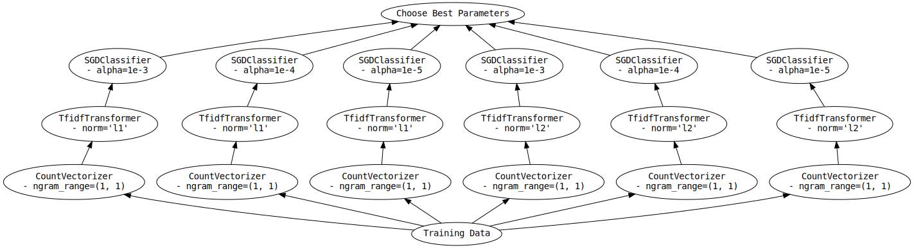

Hyper Parameter Search
======================

*Tools to perform hyperparameter optimizaiton of Scikit-Learn API-compatible
models using Dask, and to scale hyperparameter optimization to either* **larger
data** *or* **more computational power.**

Scaling hyperparameter searches
-------------------------------

Model selection searches are plagued by two issues:

1. The computation takes too long regardless of data size, a.k.a being
   **"compute constrained".** This typically happens when many hyperparameters
   need to be tuned (like the hyperparameter of neural networks; learning rate,
   batch size, momentum, etc)
2. The dataset size is too large, a.k.a. being **"memory constrained".** This
   typically happens when a model needs to be tuned for a larger-than-memory
   dataset.

These issues are independent and both can happen the same time. Here's an
example of what "compute constrained" means:

.. code:: python

   from scipy.stats import uniform, loguniform
   from sklearn.linear_model import SGDClasifier

   model = SGDClasifier()

   # not compute constrained
   params = {"l1_ratio": uniform(0, 1)}

   # compute constrained
   params = {
       "l1_ratio": uniform(0, 1),
       "alpha": loguniform(1e-5, 1e-1),
       "penalty": ["l2", "l1", "elasticnet"],
       "learning_rate": ["invscaling", "adaptive"],
       "power_t": uniform(0, 1),
       "average": [True, False],
   }

Here's an example of what "memory constrained" means:

.. code:: python

   # not memory constrained
   import pandas as pd
   df = pd.read_csv("0.parquet")
   print(df.shape)  # (30000, 200) => 23MB

   # memory constrained
   import dask.dataframe as dd
   # Read 1000 of the above dataframes (22GB of data)
   ddf = dd.read_parquet("*.parquet")

Dask-ML addresses both these cases:

Neither compute nor memory constrained
^^^^^^^^^^^^^^^^^^^^^^^^^^^^^^^^^^^^^^

This case happens when there aren't many hyperparameters to search and the data
is small, or if the search can run reasonably well on your laptop.

Scikit-learn handles this case:

.. autosummary::
   sklearn.model_selection.GridSearchCV
   sklearn.model_selection.RandomizedSearchCV

Memory constrained, but not compute constrained
^^^^^^^^^^^^^^^^^^^^^^^^^^^^^^^^^^^^^^^^^^^^^^^

This case happens when the data is large but there aren't many hyperparameters
to search over.

Dask-ML has some drop in replacements for the Scikit-learn versions:

.. autosummary::
   dask_ml.model_selection.GridSearchCV
   dask_ml.model_selection.RandomizedSearchCV

These estimators call ``fit`` on the data provided. The data provided to
``fit`` should fit in the memory of one worker. By default, they score
different models by training estimators in parallel and averaging their scores.
They avoid unnecessary computation by avoiding repeated work (i.e., in
pipelines). More detail is in :ref:`hyperparameter.drop-in`.

This estimator mirrors randomized or grid search by default but generalizes to
larger datasets by training each model on the entire dataset.

.. autosummary::
   dask_ml.model_selection.IncrementalSearchCV

It does this by calling ``partial_fit`` on each chunk of the data.  This
estimator cannot perform repeated cross-validation like
:class:`~dask_ml.model_selection.RandomizedSearchCV` or
:class:`~dask_ml.model_selection.GridSearchCV`. More detail is in
:ref:`hyperparameter.incremental`.

.. _hyperparameter.compute-not-memory-constrained:

Compute constrained, but not memory constrained
^^^^^^^^^^^^^^^^^^^^^^^^^^^^^^^^^^^^^^^^^^^^^^^

This case happens when the data is small (or fits on in the memory of one
machine) but there are a lot of hyperparameters to search. An example of this
is a neural network to learn MNIST: it's a pretty small dataset (about 44MB) but requires a neural network and all the associated hyperparameters.

.. autosummary::
   dask_ml.model_selection.HyperbandSearchCV
   dask_ml.model_selection.SuccessiveHalvingSearchCV

These searches can reduce time to solution by (cleverly) deciding which
parameters to evaluate. These searches *adapt* to history to decide which
parameters to continue evaluating.

Compute and memory constrained
^^^^^^^^^^^^^^^^^^^^^^^^^^^^^^

This case happens when the dataset is larger than memory and there are many
parameters to search.

See :ref:`hyperparameter.compute-not-memory-constrained`. These estimators also
work with larger-than-memory datasets.

.. _hyperparameter.drop-in:

Drop-In Replacements for Scikit-Learn
-------------------------------------

Dask-ML implements drop-in replacements for
:class:`~sklearn.model_selection.GridSearchCV` and
:class:`~sklearn.model_selection.RandomizedSearchCV`.

.. autosummary::
   dask_ml.model_selection.GridSearchCV
   dask_ml.model_selection.RandomizedSearchCV

The varians in Dask-ML implement many (but not all) of the same parameters,
and should be a drop-in replacement for the subset that they do implement.
In that case, why use Dask-ML's versions?

- :ref:`Flexible Backends <flexible-backends>`: Hyperparameter
  optimization can be done in parallel using threads, processes, or distributed
  across a cluster.

- :ref:`Works well with Dask collections <works-with-dask-collections>`. Dask
  arrays, dataframes, and delayed can be passed to ``fit``.

- :ref:`Avoid repeated work <avoid-repeated-work>`. Candidate models with
  identical parameters and inputs will only be fit once. For
  composite-models such as ``Pipeline`` this can be significantly more
  efficient as it can avoid expensive repeated computations.

Both scikit-learn's and Dask-ML's model selection meta-estimators can be used
with Dask's :ref:`joblib backend <joblib>`.

.. _flexible-backends:

Flexible Backends
^^^^^^^^^^^^^^^^^

Dask-ml can use any of the dask schedulers. By default the threaded
scheduler is used, but this can easily be swapped out for the multiprocessing
or distributed scheduler:

.. code-block:: python

    # Distribute grid-search across a cluster
    from dask.distributed import Client
    scheduler_address = '127.0.0.1:8786'
    client = Client(scheduler_address)

    search.fit(digits.data, digits.target)

.. _works-with-dask-collections:

Works Well With Dask Collections
^^^^^^^^^^^^^^^^^^^^^^^^^^^^^^^^

Dask collections such as ``dask.array``, ``dask.dataframe`` and
``dask.delayed`` can be passed to ``fit``. This means you can use dask to do
your data loading and preprocessing as well, allowing for a clean workflow.
This also allows you to work with remote data on a cluster without ever having
to pull it locally to your computer:

.. code-block:: python

    import dask.dataframe as dd

    # Load data from s3
    df = dd.read_csv('s3://bucket-name/my-data-*.csv')

    # Do some preprocessing steps
    df['x2'] = df.x - df.x.mean()
    # ...

    # Pass to fit without ever leaving the cluster
    search.fit(df[['x', 'x2']], df['y'])

This example will compute each CV split and store it on a single machine so
``fit`` can be called.

.. _avoid-repeated-work:

Avoid Repeated Work
^^^^^^^^^^^^^^^^^^^

When searching over composite models like ``sklearn.pipeline.Pipeline`` or
``sklearn.pipeline.FeatureUnion``, Dask-ML will avoid fitting the same
model + parameter + data combination more than once. For pipelines with
expensive early steps this can be faster, as repeated work is avoided.

For example, given the following 3-stage pipeline and grid (modified from `this
scikit-learn example
<http://scikit-learn.org/stable/auto_examples/model_selection/grid_search_text_feature_extraction.html>`__).

.. code-block:: python

    from sklearn.feature_extraction.text import CountVectorizer, TfidfTransformer
    from sklearn.linear_model import SGDClassifier
    from sklearn.pipeline import Pipeline

    pipeline = Pipeline([('vect', CountVectorizer()),
                         ('tfidf', TfidfTransformer()),
                         ('clf', SGDClassifier())])

    grid = {'vect__ngram_range': [(1, 1)],
            'tfidf__norm': ['l1', 'l2'],
            'clf__alpha': [1e-3, 1e-4, 1e-5]}

the Scikit-Learn grid-search implementation looks something like (simplified):

.. code-block:: python

	scores = []
	for ngram_range in parameters['vect__ngram_range']:
		for norm in parameters['tfidf__norm']:
			for alpha in parameters['clf__alpha']:
				vect = CountVectorizer(ngram_range=ngram_range)
				X2 = vect.fit_transform(X, y)
				tfidf = TfidfTransformer(norm=norm)
				X3 = tfidf.fit_transform(X2, y)
				clf = SGDClassifier(alpha=alpha)
				clf.fit(X3, y)
				scores.append(clf.score(X3, y))
	best = choose_best_parameters(scores, parameters)

As a directed acyclic graph, this might look like:

In contrast, the dask version looks more like:

.. code-block:: python

	scores = []
	for ngram_range in parameters['vect__ngram_range']:
		vect = CountVectorizer(ngram_range=ngram_range)
		X2 = vect.fit_transform(X, y)
		for norm in parameters['tfidf__norm']:
			tfidf = TfidfTransformer(norm=norm)
			X3 = tfidf.fit_transform(X2, y)
			for alpha in parameters['clf__alpha']:
				clf = SGDClassifier(alpha=alpha)
				clf.fit(X3, y)
				scores.append(clf.score(X3, y))
	best = choose_best_parameters(scores, parameters)

With a corresponding directed acyclic graph:

.. figure:: images/merged_grid_search_graph.svg
   :alt: "Dask-ML grid-search directed acyclic graph"
   :align: center

Looking closely, you can see that the Scikit-Learn version ends up fitting
earlier steps in the pipeline multiple times with the same parameters and data.
Due to the increased flexibility of Dask over Joblib, we're able to merge these
tasks in the graph and only perform the fit step once for any
parameter/data/model combination. For pipelines that have relatively
expensive early steps, this can be a big win when performing a grid search.

.. _hyperparameter.incremental:

Incremental Hyperparameter Optimization
---------------------------------------

.. autosummary::
   dask_ml.model_selection.IncrementalSearchCV
   dask_ml.model_selection.HyperbandSearchCV
   dask_ml.model_selection.SuccessiveHalvingSearchCV

These estimators act identically. The example will use
:class:`~dask_ml.model_selection.HyperbandSearchCV`.

.. note::

   These estimators require that the model implement ``partial_fit``

By default, these class will call ``partial_fit`` on each chunk of the data.
These classes can stop training any models if their score stops increasing
(via ``patience`` and ``tol``). They even get one step fancier, and can choose
which models to call ``partial_fit`` on.

First, let's look at basic usage. Some more adaptive use will be detailed in
:ref:`hyperparameter.adaptive`.

Basic use
^^^^^^^^^

This section uses :class:`~dask_ml.model_selection.HyperbandSearchCV`, but it can
also be applied to to :class:`~dask_ml.model_selection.IncrementalSearchCV` too.

.. ipython:: python

    from dask.distributed import Client
    client = Client()
    import numpy as np
    from dask_ml.datasets import make_classification
    X, y = make_classification(chunks=20, random_state=0)

Our underlying model is an :class:`sklearn.linear_model.SGDClasifier`. We
specify a few parameters common to each clone of the model:

.. ipython:: python

    from sklearn.linear_model import SGDClassifier
    clf = SGDClassifier(tol=1e-3, penalty='elasticnet', random_state=0)

We also define the distribution of parameters from which we will sample:

.. ipython:: python

    params = {'alpha': np.logspace(-2, 1, num=1000),
              'l1_ratio': np.linspace(0, 1, num=1000),
              'average': [True, False]}

Finally we create many random models in this parameter space and
train-and-score them until we find the best one.

.. ipython:: python

    from dask_ml.model_selection import HyperbandSearchCV

    search = HyperbandSearchCV(clf, params, max_iter=81, random_state=0)
    search.fit(X, y, classes=[0, 1]);
    search.best_score_
    search.best_params_

Note that when you do post-fit tasks like ``search.score``, the underlying
model's score method is used. If that is unable to handle a
larger-than-memory Dask Array, you'll exhaust your machines memory. If you plan
to use post-estimation features like scoring or prediction, we recommend using
:class:`dask_ml.wrappers.ParallelPostFit`.

.. ipython:: python

   from dask_ml.wrappers import ParallelPostFit
   params = {'estimator__alpha': np.logspace(-2, 1, num=1000),
             'estimator__l1_ratio': np.linspace(0, 1, num=1000)}
   est = ParallelPostFit(SGDClassifier(tol=1e-3, random_state=0))
   search = HyperbandSearchCV(est, params, max_iter=9, random_state=0)
   search.fit(X, y, classes=[0, 1]);
   search.score(X, y)

Note that the parameter names include the ``estimator__`` prefix, as we're
tuning the hyperparameters of the :class:`sklearn.linear_model.SGDClasifier`
that's underlying the :class:`dask_ml.wrappers.ParallelPostFit`.

.. _hyperparameter.adaptive:

Adaptive Hyperparameter Optimization
------------------------------------

:class:`~dask_ml.model_selection.HyperbandSearchCV` determines when to
stop calling ``partial_fit`` by `adapting to previous calls`. It has several
niceties:

* :class:`~dask_ml.model_selection.HyperbandSearchCV` will *quickly* find high
  performing models (and provably too!)
* :class:`~dask_ml.model_selection.HyperbandSearchCV` has simple input
  parameters (it only requires ``max_iter``). This is simpler than
  :class:`~dask_ml.model_selection.RandomizedSearchCV`, which requires
  ``max_iter`` and ``n_initial_parameters``.

More detail and performance comparisons with
:class:`~dask_ml.model_selection.IncrementalSearchCV` are in the Dask blog:
"`Better and faster hyperparameter optimization with Dask
<https://blog.dask.org/2019/09/30/dask-hyperparam-opt>`_", which includes a
section on "`Hyperband parameters: rule of thumb
<https://blog.dask.org/2019/09/30/dask-hyperparam-opt#hyperband-parameters-rule-of-thumb>`_,
which mentions how to select ``max_iter`` and the Dask array chunk size.

:class:`~dask_ml.model_selection.IncrementalSearchCV` can adapt to previous
scores by changing ``decay_rate`` (``decay_rate=1`` is suggested `if` it's
changed).
